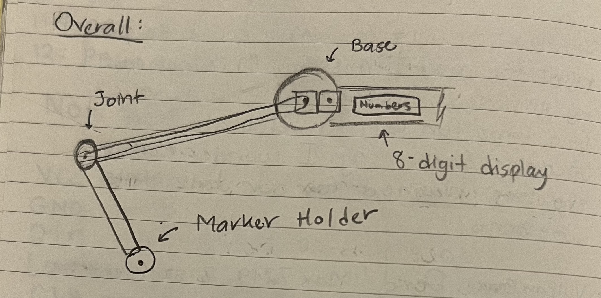

## Members
Henry Forsyth, Computer Engineering Student (2025)
rhforsythjr@vt.edu

## Photo

## Mentor
Henry Forsyth, Computer Engineering Student (2025)

## Current Status
In Progress

## Project Overview

The aim of this project is to create an "Internet of Things" (IoT) arm that consists of two units connected via a server, enabling them to write on their own whiteboards. This innovative solution leverages IoT technology to enhance collaboration and communication by automating the whiteboard writing process.

The project involves designing and developing two interconnected units: the IoT arm and the whiteboard. The IoT arm will be equipped with sensors, actuators, and a writing mechanism. These components will enable the arm to move, position itself accurately, and write on the whiteboard based on input received from the server.

The server acts as the central control unit, facilitating communication between the two units. It receives input, such as text or drawings, from various sources, such as user input or external devices. The server processes this input and sends commands to the IoT arm, instructing it to move and write accordingly. Additionally, the server can receive feedback from the IoT arm, providing status updates or error notifications.

The primary goal of this project is to provide an automated and collaborative solution for whiteboard-based communication. Users can interact with the system through a user-friendly interface, either by directly inputting text or drawings or by integrating external devices for automatic data transmission. The IoT arm's precise movements and the server's seamless coordination ensure accurate and legible writing on the whiteboard.

Key considerations for this project include designing a robust and secure communication protocol between the IoT arm, whiteboard, and server. The system should also prioritize user-friendly interfaces, intuitive controls, and a scalable architecture to accommodate future enhancements or integration with other IoT devices.

Overall, the "Internet of Things" whiteboard project aims to revolutionize traditional whiteboard communication by harnessing IoT technology. By automating the writing process and enabling seamless collaboration, this project can enhance productivity and streamline communication in various contexts, such as classrooms, meeting rooms, or collaborative workspaces.

## Educational Value Added

The IoT whiteboard project enhances educational value by promoting interactive learning, remote collaboration, accessibility, personalization, technological literacy, creativity, and STEM education. By leveraging IoT technology, this project offers innovative ways to engage and empower learners, creating a dynamic and inclusive educational environment.

## BOM + Component Cost

[Bill of Materials](https://github.com/Forsyth-Creations/IOT_Arm/blob/main/BOM.xlsx)

## Plan of Action:

### Step 1: Baseline integration of all actuators and sensors

- [x] Place Purchase order for BOM
- [ ] Draw up hardware architecture diagram
- [ ] Begin to code system integration tests
- [ ] Begin to design physical housing and system

### Step 2: Consolidate circuits onto one board

- [ ] Upon completing integration, core elements should be consolidated to the motherboard. These are
    - SD Card Reader
    - Motor Drivers
    - USB C Connector

    Note: the intention is to leave the NodeMCU as a pop-on, using female dupont connectors. This will make swapping it in and out to code easier. However, the eventual goal is to have this interface with an on-board USB-C connector, to bring the interface into the 21st century. Additionally, updating the software will eventually only take a push to Github, and a software release which the arm will pull in

- [ ] Order the motherboard for the system, await arrival

### Step 3: Write server code to allow for IOT implementation (No third-party tools)

- [ ] Use FastAPI to create a simply pythin script which the two arms can use to communicate with one another. Even better, making a point-to-point system with no server would be nice, but might need additional networking configurations to all data to get around network firewalls. Thus the server makes more sense. 

### Step 4: Integrate automatic software updates

- [ ] Go through integration hell, get it done and working. The idea for this is to use binary transfer to download the software from the release repo, then pull the firmware.bin onto the microcontroller to run. I may need an external EEPROM, or I can save configs to the SD card. May be easier to save to the SD card for the time being

## Useful Links

- Binary Transfer
    - https://www.aranacorp.com/en/generating-and-uploading-bin-files-to-an-esp8266/
