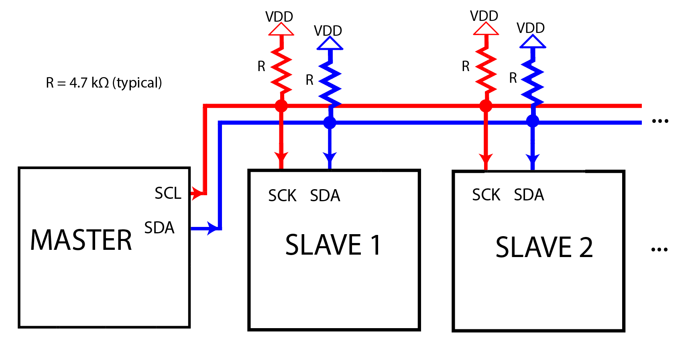
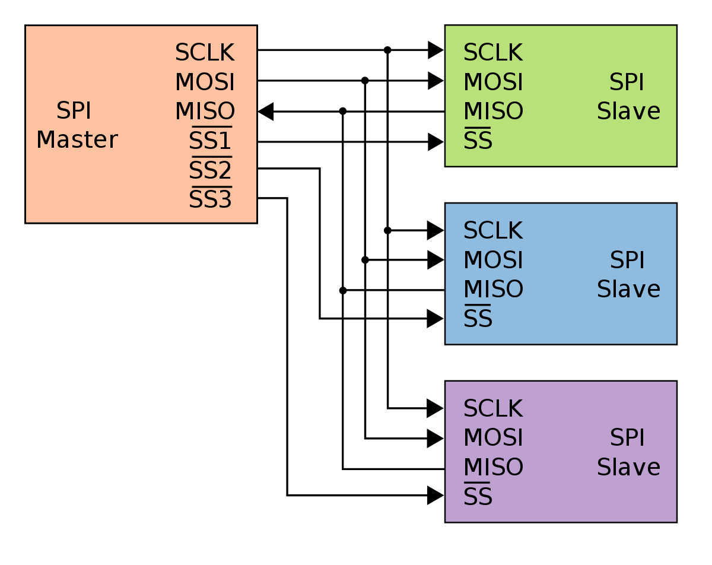
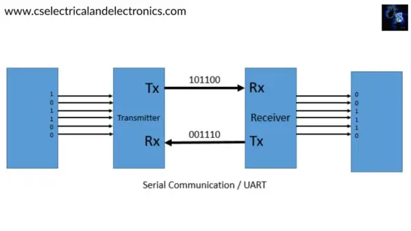

# Getting Started with the Hardware

The hardware is designed with a software called KiCAD. Many of the symbols and footprints are either crafted from scratch or they are pulled from SnapEDA.

Here are some tutorials that could be useful in the future for your development. As a general rule: developing symbols and footprints is not preferred unless __absolutely necessary__.

## Links

[Importing from SnapEDA](https://www.youtube.com/watch?v=W9cLnIjvybo&ab_channel=PlumPot)

[Creating Custom Symbols](https://www.youtube.com/watch?v=LhFWFO8H0jQ)

# Understand KiCAD... Again

So there's a hierarchy ro these things. Note the following:

- Project
    - Symbol (Which is a subset of a symbol library)
    - footprint (Which is a subset of a footprint library)

**The footprint and symbol libraries actually happen in parallel: this is an important distinction, as it abstracts out the idea that you can have multiple of the same basic symbol element that might correspond to a different footprint (you'll catch on)

TLDR: with SnapEDA you can download and import whatever you want (symbol, footprint, or the 3D model) into your project or the global scope of KiCad. Best practice is still to keep all project files local, as it makes it easier to share the project'

# Extensions:

.kicad_sym is most likely the symbol, whereas the .kicad_mod is probably the footprint

See [here](https://www.snapeda.com/about/import/#KiCad6) for import instructions

# Some Notes on Communication Schemes:

- I2C
    - Pins: **SCL, SDA**
    

- SPI
    - Pins: **Serial Clock (SCK), Master Out Slave In (MOSI, also known as SDO), and Master In Slave Out (MISO, also known as SDI), and SS/CS (Slave select)**
    
    For this project, with so many SPI devices, having numerous SS will be critical

- UART
    - Pins: **RX and TX**
    

# Parts and Such that were downloaded from SnapEDA

[NodeMCU](https://www.snapeda.com/parts/ESP32%20NodeMCU/Espressif%20Systems/view-part/?ref=search&t=nodemcu)

[Trinamic Steppter Motor](https://www.snapeda.com/parts/TMC2209%20SILENTSTEPSTICK/Trinamic%20Motion%20Control%20GmbH/view-part/?ref=search&t=TMC2209)

# Component Reference:

[LCD Display](http://www.lcdwiki.com/3.5inch_SPI_Module_ILI9488_SKU:MSP3520)

[SD Card 1](https://components101.com/sites/default/files/component_datasheet/Micro%20SD%20Card%20Datasheet.pdf)

[SD Card 2](https://cdn-learn.adafruit.com/downloads/pdf/adafruit-micro-sd-breakout-board-card-tutorial.pdf)

[SD Card 3](https://learn.adafruit.com/adafruit-microsd-spi-sdio/downloads)

[USB C](https://www.amazon.com/Type-C-Breakout-Serial-Connector-Converter/dp/B09KC1SMGD/ref=asc_df_B09KC1SMGD/?tag=hyprod-20&linkCode=df0&hvadid=563688069599&hvpos=&hvnetw=g&hvrand=9755782712956094385&hvpone=&hvptwo=&hvqmt=&hvdev=c&hvdvcmdl=&hvlocint=&hvlocphy=9008695&hvtargid=pla-1666317339592&psc=1&gclid=Cj0KCQjw5f2lBhCkARIsAHeTvlg_NZ_xzHFmB4f2mubfca1r2MisanFYn2mVCUghxSB9oXOO-iHXxQ8aAogiEALw_wcB)

[Rotary Encoder](https://lastminuteengineers.com/rotary-encoder-arduino-tutorial/)

[TMC2208 v3.0](https://github.com/bigtreetech/BIGTREETECH-TMC2208-V3.0/tree/master/Hardware)

[NodeMCU](https://components101.com/development-boards/nodemcu-esp8266-pinout-features-and-datasheet)

Great reference for building digital electronics:

[BTT SKR Mini V3](https://github.com/bigtreetech/BIGTREETECH-SKR-mini-E3/blob/master/hardware/BTT%20SKR%20MINI%20E3%20V3.0/Hardware/BTT%20E3%20SKR%20MINI%20V3.0_SCH.pdf)

# Notes:

- To make USB C work, you will need a USB to serial adapter
